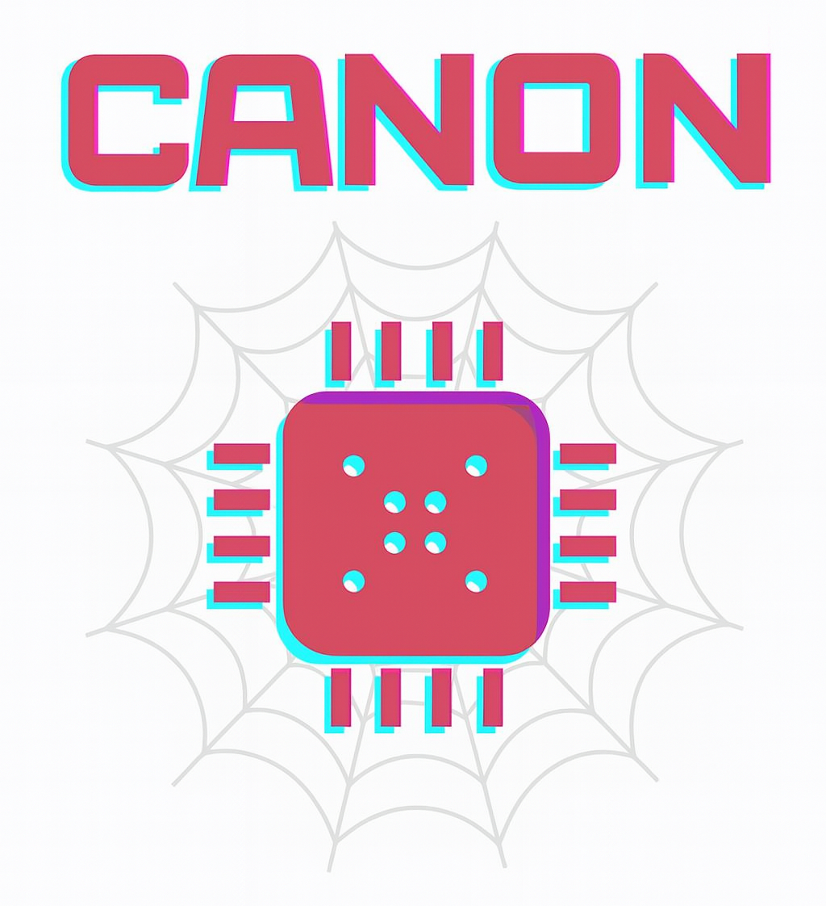
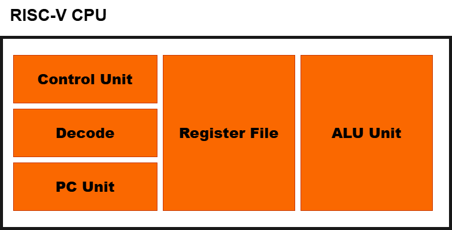

	

*A SystemC/TLM-2.0 Virtual Prototype of a RISC-V MCU for Architectural Exploration*  

## Project Overview
CANON is a lightweight **virtual prototype** of a RISC-V based microcontroller, modeled in **SystemC/TLM-2.0 (LT)**.  

The initial implementation targets the **RV32I base ISA**, with simple memory and peripheral models.

---

## Initial Modules

### 1. **RV32I CPU Core**
- Executes instructions from the RV32I base ISA.
- Communicates with memory and peripherals via a TLM initiator socket.

	

### 2. **Flash Memory (Program Storage)**
- Read-only memory that stores the program code (like MCU Flash).
- Accessed by the CPU during instruction fetch.

### 3. **SRAM (Data Memory)**
- Read/Write memory for variables and stack.
- Accessed by the CPU for load/store instructions.

### 4. **GPIO Peripheral**
- Simple memory-mapped I/O block with DIR/OUT/IN registers.

### 5. **Bus Interconnect**
- Address decoder and router between CPU and memory/peripherals.
- Provides flexibility for exploring different bus topologies in future.

## Status
🚧 Work in progress — modules under development.  