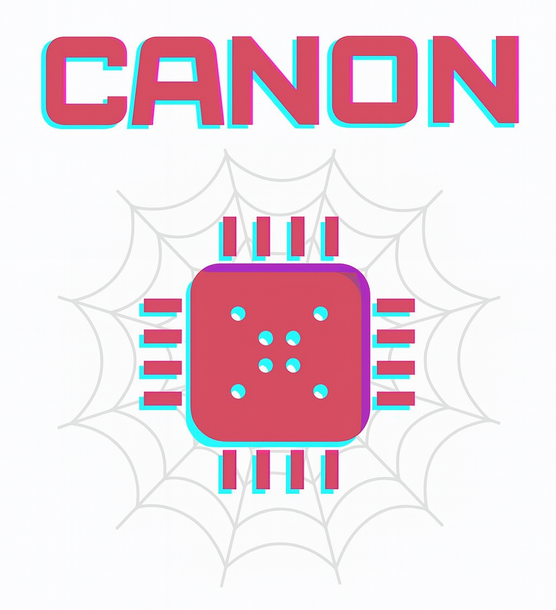
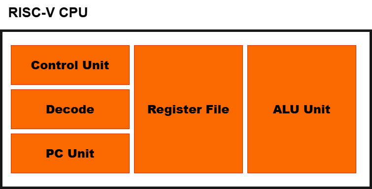

	

*A SystemC Virtual Prototype of a RISC-V CPU Core for Architectural Exploration*  

## 1. Overview
**CANON** is a lightweight **SystemC virtual prototype** of a **RISC-V CPU core**, designed for architectural exploration and educational purposes.

This project models the essential **CPU submodules:**

- Program Counter Unit  
- Register File  
- ALU  
- Decoder  
- Control Unit  

The initial ISA target is **RV32I**.

## 2. RV32I CPU Core Architecture

	

The CPU core implements a simplified RV32I pipeline (single-cycle style, LT SystemC modeling):

### Decoder (RV32I)
- Extracts rd, rs1, rs2
- Builds immediates for all RV32I formats
- Decodes ALU function, op-class, branch type, load/store modes

### ALU (RV32I)
- Implements arithmetic, logical, shift, and comparison operations  
  (ADD, SUB, AND, OR, XOR, SLL, SRL, SRA, SLT, SLTU)
- Generates branch comparison flags (`eq`, `lt_s`, `lt_u`)
- Computes JAL/JALR/branch targets

### Register File Unit
- 32 × 32-bit registers  
- Two read ports and one write port  

### Program Counter Unit
- Computes next PC:
  - `PC + 4`
  - Branch target
  - JAL target
  - JALR target 

### Control Unit
- Generates control signals:
  - PC operation  
  - Memory op (LOAD / STORE / NONE)  
  - Register write-enable  
  - Write-back selection (ALU / PC+4 / LOAD)

## 3. Project Goals
This project aims to:

- Build a simple, modular, SystemC-based RISC-v CPU
- Enable instruction level simulation for RV32I
- Gain practical experience with SystemC modeling, RISC-V architecture, CPU microarchitecture design and virtual prototyping
